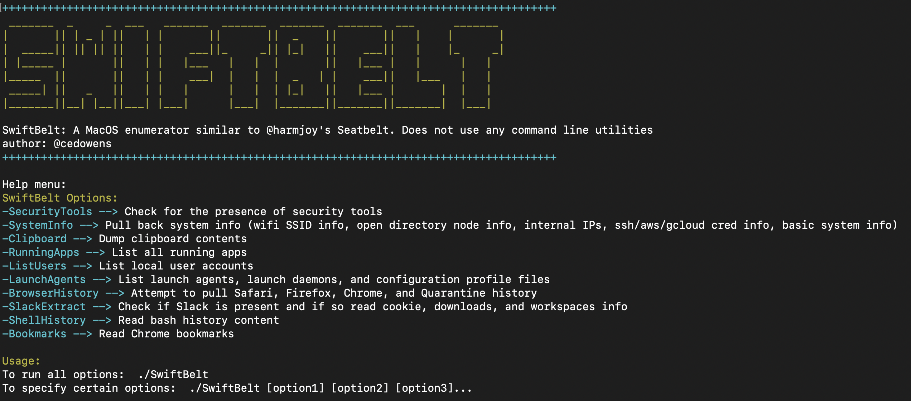

# SwiftBelt

***About***

SwiftBelt is a macOS enumerator inspired by @harmjoy's Windows-based Seatbelt enumeration tool. SwiftBelt does not utilize any command line utilities and instead uses Swift code (leveraging the Cocoa Framework, Foundation libraries, OSAKit libraries, etc.) to perform system enumeration. This can be leveraged on the offensive side to perform enumeration once you gain access to a macOS host. I intentionally did not include any functions that cause pop-ups (ex: keychain enumeration).

Thanks Ramos04 for contributing code to look for various Objective See tools and mattreduce for contributing code for zshell history as well as azure creds.

-----------------------

***Steps***

You can run the included SwiftBelt mach-o binary in the root directory of this repo or you can edit the Swift code and rebuild a new binary.

**To use the included mach-o:**

1. Note: I did not sign the included mach-o. Therefore you will need to take these steps to remove the quarantine attribute in order to run: Once downloaded, copy to the desired host and clear the quarantine attribute ($ xattr -c SwiftBelt) and set as executable ($ chmod +x SwiftBelt)
2. To see the help menu: ./SwiftBelt -h

***Help menu:***

SwiftBelt Options:

**-SecurityTools** --> Check for the presence of common macOS security tools (at least the ones I am familiar with)

**-SystemInfo** --> Pull back system info (wifi SSID info, open directory node info, internal IPs, ssh/aws/gcloud/azure-cli cred info, basic system info). If present on the host, this tool will display the contents of ssh keys, known hosts file, aws cred files, and gcloud token info

**-Clipboard** --> Dump clipboard contents

**-RunningApps** --> List all running apps

**-ListUsers** --> List local user accounts

**-LaunchAgents** --> List launch agents, launch daemons, and configuration profile files

**-BrowserHistory** --> Attempt to pull Safari, Firefox, Chrome, and Quarantine history (note as FYI: if Chrome or Firefox is actively running, the tool will not be able to read the locked database to extract info)

**-SlackExtract** --> Check if Slack is present and if so read cookie, downloads, and workspaces info (leverages research done by Cody Thomas)

**-ShellHistory** --> Read shell (Bash or Zsh) history content

**-Bookmarks** --> Read Chrome saved bookmarks

***Usage:***

To run all options:  *./SwiftBelt*

To specify certain options:  *./SwiftBelt [option1] [option2] [option3]...*

**Example:  *./SwiftBelt -SystemInfo -Clipboard -SecurityTools ...***

**To edit the Swift code and rebuild your own mach-o:**
1. Open the xcodeproj file for SwiftBelt in Xcode 

2. Edit the code in main.swift code as needed in Xcode

3. From a terminal cd into the SwiftBelt directory and run: "swift build" to generate the binary. The binary will be dropped in the .build/debug folder inside of the SwiftBelt folder and will be named SwiftBelt

4. Copy to the desired host and clear the quarantine attribute ($ xattr -c SwiftBelt) and set as executable ($ chmod +x SwiftBelt)

5. Execute 

-----------------------

***Detection***

Though this tool does not use any command line utilities (which are easy to detect), this tool does read from several files on the system which can be detected by any tools that leverage the Endpoint Security Framework (these file reads in particular are captured by ES_EVENT_TYPE_NOTIFY_OPEN events within ESF).
